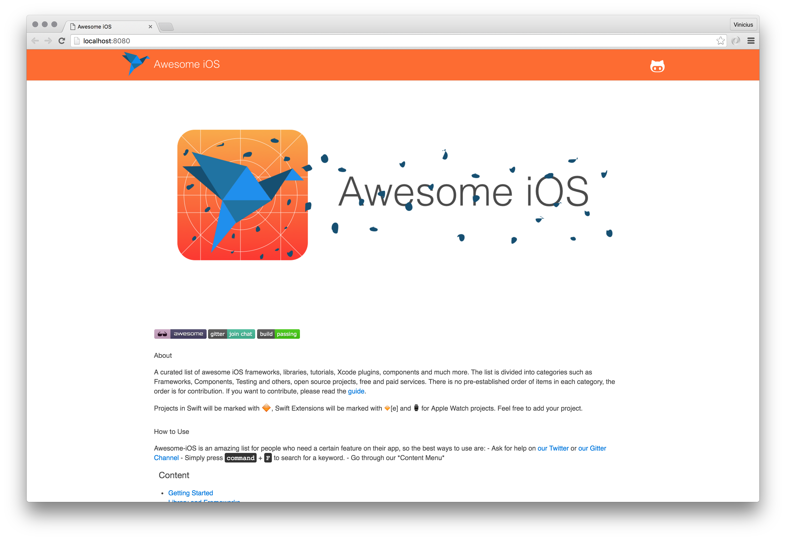

# awesomeios.com
> A website with all awesome-ios content and more.

[![Swift Version][swift-image]][swift-url]
[![Build Status][travis-image]][travis-url]
[![License][license-image]][license-url]

About [awesome-iOS](http://github.com/vsouza/awesome-ios) : A curated list of awesome iOS frameworks, libraries, tutorials, Xcode plugins, components and much more. The list is divided into categories such as Frameworks, Components, Testing and others, open source projects, free and paid services.

## Development setup

We use [swiftenv](https://github.com/kylef/swiftenv), a nice project made by [@kylef](https://github.com/kylef).

after installing `swiftenv`, run:

`swiftenv install` or `make deps-install`

then start the project:

`make run-debug`

you'll be able to connect on `localhost:8080`

## Release History

* 0.0.1
    * Work in progress
    * Publish awesome-iOS repo content. (awesomeios.com)
	* Structure folders and configuration files

## Meta

vsouza – [@iamvsouza](https://twitter.com/iamvsouza)

lfarah – [@iamvsouza](https://twitter.com/lfarah)

dkhamsing  – [@dkhamsing](https://twitter.com/dkhamsing)

Distributed under the MIT license. See [LICENSE](https://github.com/vsouza/awesomeios.com/blob/master/LICENSE) for more information.

[https://github.com/vsouza/awesomeios.com](https://github.com/vsouza/awesomeios.com)

[swift-image]: https://img.shields.io/badge/swift-2.2-orange.svg?style=flat-square
[swift-url]: https://swift.org
[license-image]: https://img.shields.io/badge/License-MIT-blue.svg?style=flat-square
[license-url]: https://github.com/vsouza/awesomeios.com/blob/master/LICENSE
[travis-image]: https://img.shields.io/travis/vsouza/awesomeios.com/master.svg?style=flat-square
[travis-url]: https://travis-ci.org/vsouza/awesomeios.com
